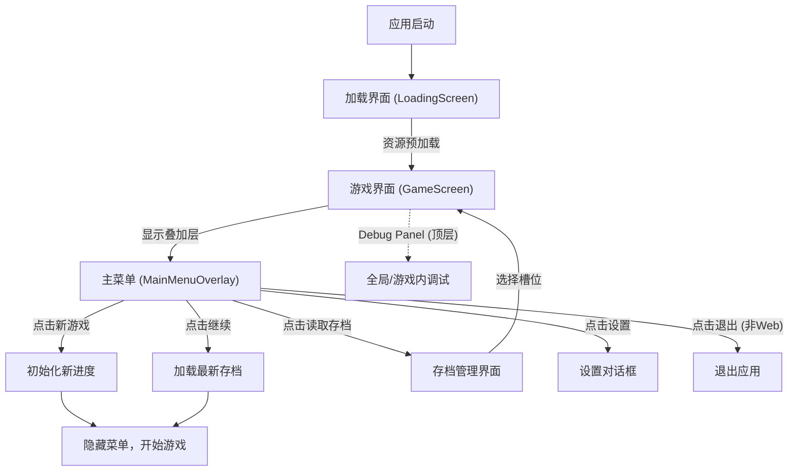

# 2.10 主菜单设计 (Main Menu Design)

## 2.10.1 概述
主菜单是玩家进入游戏的第一个界面，提供开始新游戏、继续游戏、设置和退出等基本功能。此外，主菜单还集成了调试工具，便于开发者管理全局数据。

## 2.10.2 视觉设计
- **动态背景**：主菜单不再使用静态图片，而是直接嵌入游戏场景。如果检测到现有存档，将自动加载时间戳最近的存档场景（港口或海上）作为背景；若无存档，则显示初始主岛场景。
- **背景层叠**：背景保留昼夜变化、海浪晃动和动态天体效果，营造沉浸式体验。
- **过渡效果 (Smooth Transitions)**：
  - **菜单按钮淡化/淡入**：进入游戏时，主菜单按钮和标题会平滑淡出（500ms），随后游戏内 UI 平滑淡入。返回主菜单时，主菜单组件也会以同样的平滑方式淡入。
  - **智能封面遮罩 (Smart Cover Overlay)**：当从主菜单进入游戏，或从游戏返回主菜单时，如果目标场景与当前动态背景不一致，系统会自动淡入封面图 (`assets/images/painting/Cover_0.png`) 作为遮罩。在遮罩完全覆盖期间，系统会在后台静默切换 `GameState` 并更新背景场景，随后淡出遮罩揭晓目标状态，彻底消除场景跳变感。
  - **游戏内 UI 淡入**：进入游戏场景后，所有的交互按钮、状态栏、时间显示等 UI 元素将平滑淡入（500ms），提供连贯的视觉反馈。
- **按钮样式映射**：
  - **新游戏**：`PaperButtonStyle.brown`
  - **继续游戏**：`PaperButtonStyle.blue`
  - **读取存档**：`PaperButtonStyle.blue`
  - **设置**：`PaperButtonStyle.brown`
  - **退出**：`PaperButtonStyle.brown`
- **标题**："Cruising" 使用大号加粗白色字体，带有阴影效果，位于屏幕顶部中央。
- **布局**：按钮垂直排列在屏幕中央，标题位于按钮上方。
- **版本号显示**：
  - **位置**：屏幕左下角。
  - **样式**：半透明白色文字（`Colors.white.withValues(alpha: 0.7)`），字号 14，带阴影。
  - **内容**：格式为 `vX.Y.Z`，数据来源于 `VersionConstants`。
  - **隐藏逻辑**：作为 `MainMenuOverlay` 的一部分，仅在主菜单显示时可见，进入游戏后随菜单一同隐藏。

## 2.10.3 逻辑与状态管理
- **菜单模式 (isMenuMode)**：当显示主菜单叠加层时，`GameState` 处于菜单模式。此时，游戏时间流逝、工资支付、税收生成等逻辑均会暂停，但海浪晃动、天体运行等基础视觉动画保持运行。
- **延迟初始化**：任务系统 (`QuestSystem`) 的初始化被延迟到玩家真正进入游戏后（点击新游戏/继续/加载存档），以防止新手教程在主菜单界面意外触发。

## 2.10.3 功能按钮
1. **新游戏 (New Game)**
   - 功能：开始一个新的游戏会话。
   - 交互：由于资源已在启动时预加载完成，点击后直接进入 `GameScreen`。
   - 逻辑：重置游戏状态（目前每次进入 `GameScreen` 都会重新初始化）。

2. **继续游戏 (Continue)**
   - 功能：自动读取时间最近的一个存档并继续游戏。
   - 逻辑：扫描所有存档槽位，按时间戳降序排序，加载第一个。
   - 交互：由于资源已在启动时预加载完成，点击后带存档数据直接进入 `GameScreen`。
   - 状态：如果无存档，弹出提示框 "暂无存档"。

3. **读取存档 (Load Game)**
   - 功能：进入存档管理界面 (`SaveLoadScreen`)。
   - 交互：显示所有存档槽位（自动 + 手动），允许玩家选择读取。

4. **设置 (Settings)**
   - 功能：调整游戏设置。
   - 交互：点击弹出对话框。
   - 基础选项：
     - 音乐开关
     - 音效开关
   - 显示设置（仅桌面端）：
     - **全屏模式**：切换窗口/全屏显示。
     - **分辨率选择**：在窗口模式下，提供多种分辨率预设（如 1280x720, 1920x1080 等），选择后自动调整窗口大小并居中。

5. **退出 (Exit)**
   - 功能：退出应用程序。
   - 实现：调用 `SystemNavigator.pop()`。
   - **Web 端处理**：由于浏览器安全限制，Web 平台下隐藏此按钮。

## 2.10.5 调试功能
主菜单集成了全局 **Debug Panel**（位于屏幕右上角），始终位于最顶层 `Stack` 中，无论在菜单模式还是游戏进行中均可见且可用。
- **入口**：右上角悬浮按钮（虫子图标）。
- **主要功能**：
  - **删除所有存档**：一键清空所有游戏进度，用于重置测试环境。
  - **状态监控**：虽然不在游戏内，但保留了面板结构，方便扩展其他全局调试功能。

## 2.10.5 文件结构
- `lib/game/main_menu_overlay.dart`: 主菜单按钮和标题组件，作为叠加层显示。
- `lib/screens/game_screen.dart`: 游戏主界面，负责管理菜单模式状态、加载动态背景以及集成调试面板。
- `lib/game/debug_panel.dart`: 调试面板组件，直接集成在 `GameScreen` 顶层。
- `lib/main.dart`: 应用程序入口，负责初始化并加载 `GameScreen`。
- `lib/utils/version_constants.dart`: 集中管理版本号的常量文件。

## 2.10.6 版本管理策略 (Version Management Strategy)
版本号遵循 `X.Y.Z` 格式，在 `lib/utils/version_constants.dart` 中统一维护：
- **第一位 (X)**：重大版本更新、大规模功能重构或架构变动。
- **第二位 (Y)**：中等规模的功能更新、新增 Feature 或较大的改进。
- **第三位 (Z)**：Bug 修复、微调或小型优化。

## 2.10.7 导航流程

## 2.10.7 依赖库
- `window_manager`: 用于桌面端的窗口大小控制、全屏切换和居中显示。
