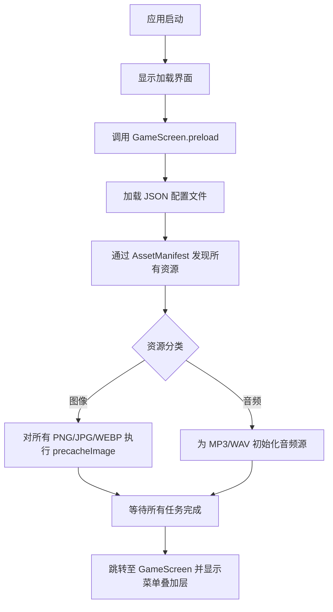

# 2.11 加载系统（Loading System）

## 2.11.1 概述
加载系统负责在场景切换（如从主菜单进入游戏，或从游戏返回主菜单）时提供平滑的过渡体验。通过显示一个短暂的加载画面，可以：
1.  遮挡场景初始化和销毁时的视觉跳变。
2.  为未来的资源预加载（如图片、音频、数据）预留占位。
3.  提供一致的用户体验反馈。

## 2.11.2 交互流程

### 应用启动 -> 主菜单
1.  用户启动游戏。
2.  首屏显示加载画面（LoadingScreen），此时背景为纯黑色。
3.  加载画面执行全量资源预加载（GameScreen.preload）。
4.  真实资源加载完成后，额外等待 1 秒（默认配置）以确保平滑过渡，随后跳转至带主菜单叠加层的游戏界面（GameScreen）。

### 主菜单 -> 游戏
1.  玩家在主菜单点击 "新游戏" 或 "继续游戏"。
2.  通过平滑动画淡出菜单叠加层。
3.  **场景一致性检查**：如果目标存档场景与当前动态背景不一致，淡入黑色遮罩层进行遮挡，静默切换 `GameState` 后再淡出遮罩。
4.  初始化任务系统并解除游戏时间暂停。
5.  游戏内 UI 元素（按钮、状态栏等）平滑淡入。

### 游戏 -> 主菜单
1.  玩家在游戏内打开设置菜单，点击 "返回主菜单"。
2.  通过平滑动画淡入黑色遮罩层遮挡当前画面。
3.  在遮罩下执行状态重置：设置 `isMenuMode = true`，重置任务系统，并重新检测最新存档以更新背景场景。
4.  淡出遮罩，平滑展示主菜单叠加层，同时游戏时间保持暂停。

## 2.11.3 UI 设计

加载画面保持极简风格。

-   **背景**：纯黑色背景（Black Screen）。
-   **加载指示器**：屏幕中央显示白色圆形进度条 (`CircularProgressIndicator`)。
-   **提示文字**：指示器下方显示 "Loading..." 文本，白色粗体，带黑色阴影以保证可读性。

## 2.11.4 技术实现

### LoadingScreen 组件
位于 `lib/screens/loading_screen.dart`。

**参数**：
-   `nextScreen` (`Widget`): 加载完成后要跳转的目标页面。
-   `duration` (`Duration`): 额外等待时间，默认为 1 秒。
-   `waitFor` (`List<Future<dynamic>>?`): 可选的等待任务列表。
-   `onLoad` (`LoadCallback?`): 可选的加载回调，类型为 `Future<void> Function(BuildContext context)`。适用于需要 `context` 的加载操作（如 `precacheImage`）。

**逻辑**：
-   在 `didChangeDependencies` 中启动加载流程（确保 context 可用）。
-   **分步等待**：
    1. 首先并行等待 `waitFor` 中的所有任务以及 `onLoad` 回调完成（真实加载时间）。
    2. 在上述所有真实加载任务完成后，**额外等待** `duration` 计时器（确保玩家能看到加载完成的确认感，避免瞬间跳转）。
-   当所有任务及额外等待都完成后，使用 `Navigator.pushReplacement` 跳转至 `nextScreen`。
-   使用 `FadeTransition` (800ms) 实现页面间的平滑淡入淡出。

**使用示例**：

基础使用（仅等待1秒）：
```dart
LoadingScreen(nextScreen: GameScreen())
```

带 onLoad 回调（等待游戏资源预加载）：
```dart
LoadingScreen(
  nextScreen: const GameScreen(),
  onLoad: GameScreen.preload,
)
```

带 waitFor 任务列表：
```dart
LoadingScreen(
  nextScreen: GameScreen(),
  waitFor: [
    loadAssets(),
    initializeGameData(),
  ],
)
```

### GameScreen 预加载
`GameScreen` 提供静态方法 `preload(BuildContext context)` 用于预加载游戏资源。

**技术细节**：
- **动态资源发现**：使用 `AssetManifest` 自动扫描 `assets/` 目录下的所有文件，无需手动维护列表。
- **图像预加载**：自动识别所有常见的图像格式（`.png`, `.jpg`, `.jpeg`, `.webp`, `.gif`），并通过 `precacheImage` 将其上传至 GPU 显存。
- **音频预加载**：自动识别所有音频格式（`.mp3`, `.wav`, `.ogg`），通过临时初始化 `AudioPlayer` 触发系统解码，消除游戏内首次播放时的延迟。
- **健壮性**：预加载过程包含完整的错误处理，单个资源加载失败不会中断整体流程。

**加载顺序**：
1.  **加载游戏配置**：优先加载 `GameConfigLoader` 中的 JSON 配置文件。
2.  **动态扫描资源**：通过 `AssetManifest` 获取全量资源列表。
3.  **并行图像预加载**：利用 `Future.wait` 并行加载所有图像。
4.  **顺序音频解码**：遍历音频列表进行初始化解码。

所有资源预加载完成后，`LoadingScreen` 才会跳转到游戏界面，确保游戏过程零卡顿。

## 2.11.5 预加载流程图



### 导航管理
使用 `pushReplacement` 替代 `push`，确保加载画面在跳转后从导航堆栈中移除。这样用户在目标页面按“返回”键时，不会错误地回到加载画面，也不会回到已销毁的前一个场景。

