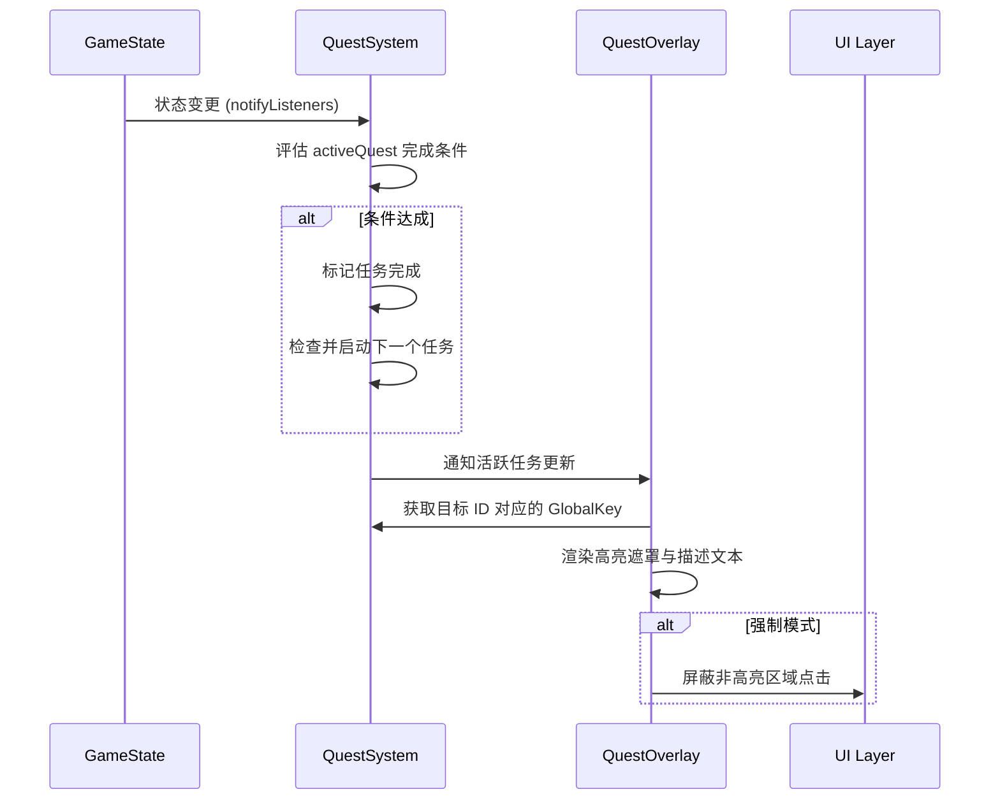

# 2.16 Quest System

## 2.16.1 系统概述
任务系统（Quest System）是一个通用的逻辑驱动框架，用于引导玩家完成特定的游戏目标。它不仅支持游戏初期的教学引导（Tutorial），还可以扩展为剧情任务或成就系统。该系统能够实时监测游戏状态（GameState），在满足特定条件时触发任务或标记任务完成。

## 2.16.2 核心组件

### 1. Quest 模型 (`lib/models/quest.dart`)
定义单个任务的数据结构：
- `id`: 任务唯一标识符（如 `T01_welcome`）。
- `trigger`: 触发条件（如 `on_new_game_start` 或 `after(T01)`）。
- `highlight`: 需要高亮的 UI 组件标识符（如 `ui.marketButton`）。
- `text`: 展示给玩家的任务描述文本。
- `complete_when`: 任务完成条件的逻辑表达式（如 `cargo.count('food') >= 10`）。
- `on_fail_hint`: 任务失败时的提示。
- `action`: 任务完成时触发的特殊动作（如 `ui.marketPanel.close` 或 `ui.shipyard.close`）。
- `is_mandatory`: 是否为强制任务。若为 true，系统将屏蔽高亮区域以外的所有交互。

### 2. QuestSystem 逻辑管理 (`lib/systems/quest_system.dart`)
- **任务追踪**: 维护当前活跃任务（`activeQuest`）和已完成任务列表。
- **触发检查**: 监听 `GameState` 变化，自动触发满足 `trigger` 条件的任务。
- **条件评估器**: 解析 `complete_when` 字符串，通过访问 `GameState` 实时判断任务是否达成。
- **Key 注册表**: 维护一个 `Map<String, GlobalKey>`，用于存储当前可见 UI 组件的定位标识。
- **QuestTarget 包装器**: 在 `lib/systems/quest_system.dart` 中提供 `QuestTarget` 组件，供 UI 层使用。它自动管理私有 `GlobalKey` 的生命周期并注册到系统中。这种模式确保了每个 UI 目标拥有独立且唯一的 Key，彻底解决了列表复用和页面切换时的 GlobalKey 冲突。

### 3. QuestOverlay 视觉指引 (`lib/game/layers/quest_overlay.dart`)
- **层级位置**: 挂载于 `MaterialApp.builder` 的 `Stack` 中，确保其层级高于 `Navigator`，能够覆盖 `showDialog` 弹出的所有对话框。
- **高亮遮罩**: 使用 `CustomPaint` 结合 `BlendMode.clear` 技术在屏幕上绘制半透明层（透明度 `0.7`），并在目标位置实现真实的“镂空”效果，确保高亮区域完全透明，展示 UI 原始亮度。
- **自适应定位**: 自动计算高亮目标在屏幕中的垂直位置。若目标位于屏幕下半部分（中心点 `dy > maxHeight / 2`），任务提示文本框将自动移动到屏幕上方（`top: 120`），反之则显示在下方（`bottom: 120`），确保文字描述不会遮挡玩家需要点击的操作目标。
- **交互控制**: 
    - 对于普通任务，仅提供视觉指引（通过 `IgnorePointer` 穿透背景）。
    - 对于强制任务（`is_mandatory: true`），通过分块的 `InteractionBlocker` 屏蔽高亮区域外的点击，而高亮区域内部支持点击穿透。
- **任务对话框**: 在屏幕边缘显示精美的纸张风格任务提示。

## 2.16.3 条件评估逻辑 (Condition Evaluation)
系统支持多种基于字符串的条件判定。支持使用 `&&` 运算符连接多个条件。**重要：** 所有作为完成条件的 `GameState` 标志位（如 `isTradeBalanced`）必须与数据变更**同步更新**，以确保任务系统在下一帧开始前能读到正确状态。

- `tap_anywhere`: 点击屏幕任意位置完成。
- `ui.marketPanel.opened`: 检查市场交易面板是否打开。
- `ui.quantitySlider.opened`: 检查交易数量选择滑块是否打开。
- `!ui.quantitySlider.opened`: 检查交易数量选择滑块是否关闭。
- `ui.sliderInteracted`: 检查滑块是否已被玩家拖动。
- `ui.sliderValue [op] [value]`: 检查滑块当前的预览数值（如 `ui.sliderValue > 10`）。
- `trade.pending('goods_id') [op] [value]`: 检查待交易清单中的物品数量（换入为正，换出为负）。
- `ui.shipyard.opened`: 检查船厂对话框是否打开。
- `cargo.count('goods_id') >= value`: 检查船只库存。
- `navigation.destination == 'port_id'`: 检查航行目的地。
- `navigation.arrived`: 检查是否到达目的地。
- `ship.cargo_level >= value`: 检查船只载货量等级。
- `ship.level >= value`: 检查船只整体等级（所有部件最低级）。
- `ship.upgrade_count >= value`: 检查船只总升级次数。
- `homeIsland.tax_collected_today == true`: 检查今日是否领过税收。
- `ui.portList.opened`: 检查港口选择列表是否打开。
- `navigation.isAtSea`: 检查船只是否正在海上航行。

## 2.16.4 工作流与集成

### 1. 配置加载
任务数据存储在 `assets/config/quests.json` 中，通过 `GameConfigLoader` 在游戏启动时加载。

### 2. UI 绑定 (UI Binding)
UI 组件（如市场按钮、商品槽位等）使用 `QuestTarget` 进行包装。组件内部会自动管理一个唯一的 `GlobalKey`：
```dart
QuestTarget(
  id: 'ui.marketButton',
  child: MyButton(...),
)
```
这种设计确保了即便存在多个同名组件（如在过渡动画期间），它们也各自持有独立的 Key，由系统根据“最后注册者优先”的原则进行定位。

### 3. 游戏内交互


## 2.16.5 扩展性
- **任务链**: 通过 `after(id)` 支持复杂的线型任务流。
- **分支任务**: 触发逻辑可扩展为支持多种前置条件。
- **成就集成**: 将简单的数值检查扩展为全游戏范围的成就追踪。

## 2.16.6 配置指南 (Configuration Guide)

任务配置文件位于 `assets/config/quests.json`。每个任务对象包含以下字段：

### 1. 触发器 (`trigger`)
控制任务何时被激活。支持使用 `&&` 组合多个条件。
- `on_new_game_start`: 新游戏开始且没有进行中的任务时触发。
- `after(quest_id)`: 在指定 ID 的任务完成后立即触发。
- **多重触发器**: 支持使用 `&&` 连接多个条件，例如 `after(T05) && navigation.arrived`。
- **状态触发**: 触发器可以直接使用 **2.16.3** 中列出的所有条件表达式（如 `navigation.arrived`, `cargo.count(...)` 等）。示例：`after(T05_sailing) && navigation.arrived`。

### 2. 完成条件 (`complete_when`)
定义玩家需要执行什么操作来完成任务。支持使用 `&&` 连接多个子条件，所有子条件必须同时满足（如 `ui.sliderInteracted && ui.sliderValue > 10`）。
- `tap_anywhere`: 点击屏幕任意位置即可。
- `ui.marketPanel.opened`: 当市场/交易对话框打开时完成。
- `ui.quantitySlider.opened`: 当物品交易的数量选择滑块面板打开时完成。
- `!ui.quantitySlider.opened`: 当物品交易的数量选择滑块面板关闭（点击确认或取消）时完成。
- `ui.sliderInteracted`: 滑块已被拖动。
- `ui.sliderValue [op] [value]`: 滑块当前的预览数值。
- `trade.pending('goods_id') [op] [value]`: 待交易清单中的物品数量。
- `ui.shipyard.opened`: 当船厂对话框打开时完成。
- `ui.tradeBalanced`: 当交易处于平衡状态（商人接受报价）时完成。
- `cargo.count('goods_id') [op] [value]`: 检查货物数量。
    - 支持的货物 ID：`food`, `wood`, `spice`, `metal` 等。
    - 支持的运算符：`>=`, `<=`, `==`, `>`, `<`。
    - 示例：`cargo.count('food') >= 10`
- `navigation.destination == 'port_id'`: 当玩家在目的地列表中选择了特定港口时完成。
    - 支持的港口 ID：`home_island`, `port_1`, `port_2`, `port_3`。
- `navigation.arrived`: 当船只结束航行并成功进入任何港口时完成。
- `ship.cargo_level >= 1`: 当船只的载货量完成至少一次升级时完成。
- `ship.level >= 1`: 当船只的整体等级（所有部件最低等级）达到至少 1 级时完成。
- `homeIsland.opened`: 当玩家回到主岛界面时完成。
- `homeIsland.tax_collected_today == true`: 当玩家点击税收气泡领取税收后完成。

### 3. 高亮指引 (`highlight`)
指定 UI 上需要用黄色边框圈出的组件。
- `none`: 不显示任何高亮遮罩（全透明），仅显示任务描述文本。
- `null`: 显示全屏半透明黑色遮罩。
- `ui.marketButton`: 主界面上的“市场”按钮。
- `ui.shipUpgradeButton`: 主界面上的“船厂”按钮。
- `ui.portListButton`: 主界面右下角的“选择目的地”按钮。
- `ui.collectTaxButton`: 主岛上方的税收气泡。
- `ui.homeIslandButton`: 目的地列表中的“我的岛屿”条目。
- `ui.travelProgressBar`: 顶部的航行进度条。
- `ui.marketPanel`: 交易对话框整体区域。
- `ui.sellButton`: 交易对话框中的“确认交易”主按钮。
- `ui.balanceButton`: 交易对话框底部的“平衡报价”按钮。
- `ui.quantitySlider`: 交易对话框内的数量选择滑块区域。
- `ui.quantitySliderTrack`: 数量选择滑块的拖动条区域（不包含按钮）。
- `ui.confirmQuantityButton`: 数量选择滑块面板右下角的“确认”按钮。
- `ui.shipyard.upgradeCargoButton`: 船厂界面中的“扩建货仓”升级按钮。
- `ui.goodsRow('goods_id')`: 交易对话框左侧【商人库存】中的特定货物槽位。
    - 示例：`ui.goodsRow('food')`
- `ui.playerGoodsRow('goods_id')`: 交易对话框右侧【玩家库存】中的特定货物槽位。
    - 示例：`ui.playerGoodsRow('food')`
- `ui.portRow('port_id')`: 目的地列表中的特定港口行。
- `ui.portDepartButton('port_id')`: 目的地列表中的特定港口的“出发”按钮。

### 4. 示例配置
```json
{
  "id": "T08a_home_island_intro",
  "trigger": "after(T07c_close_shipyard)",
  "highlight": null,
  "text": "别忘了，你还有一座属于自己的岛屿。那里也会为你产生收益。",
  "complete_when": "tap_anywhere",
  "is_mandatory": true
}
```

## 2.16.7 UI 集成 (UI Integration)

任务系统高度集成于游戏的 UI 体系中，遵循以下视觉和交互标准：

### 1. 视觉风格
任务描述对话框和 `QuestOverlay` 采用与主 UI 一致的视觉标准，详见 `[2.5 ui_system.md](2.5%20ui_system.md)`：
- **纹理**: 使用纸张纹理（Paper Texture）。
- **字体**: 使用深褐色 (`0xFF4E342E`) 墨水效果文字。
- **高亮**: 使用标准的黄色 (`Colors.amber`) 进行区域锁定。

### 2. 交互逻辑
- **QuestTarget 绑定**: UI 组件通过 `QuestTarget` 自动将其唯一的 `GlobalKey` 注册到系统中。
- **状态同步更新**: 任何影响任务完成条件的状态变更（如平衡状态、面板开关）必须在事件处理函数中同步调用 `GameState` 的设置方法，严禁使用 `PostFrameCallback` 延迟更新，以防任务评估时产生竞态条件。
- **交互拦截**: 在强制任务模式下，系统会根据高亮区域，利用分块的 `InteractionBlocker` 屏蔽高亮区域外的所有点击。
