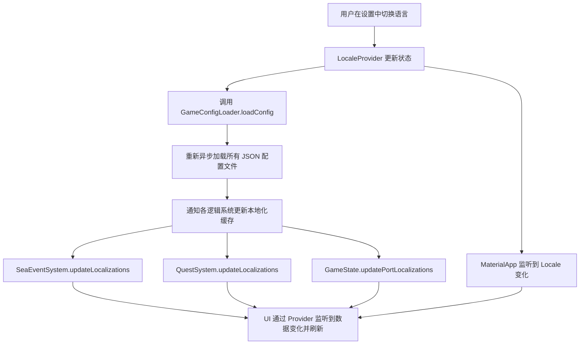

# 2.19 本地化与多语言系统 (Localization System)

## 2.19.1 系统概述
本地化系统负责管理游戏内所有用户可见文本的多语言支持。该系统分为两个核心部分：
1. **UI 文本本地化**：使用 Flutter 官方的 `gen_l10n` 工具处理代码中的硬编码字符串。
2. **游戏数据本地化**：针对外部 JSON 配置文件（如商品、港口、海上事件）的动态加载方案。

## 2.19.2 核心组件

### 1. LocaleProvider
- **位置**：`lib/providers/locale_provider.dart`
- **职责**：
  - 管理当前的 `Locale` 状态。
  - 提供 `setLocale` 和 `toggleLocale` 方法。
  - 通过 `notifyListeners()` 触发全局 UI 刷新。

### 2. GameConfigLoader (本地化增强)
- **位置**：`lib/utils/game_config_loader.dart`
- **职责**：
  - 根据当前语言代码（如 `zh`, `en`）动态拼接路径。
  - 优先尝试加载 `assets/config/{filename}_{lang}.json`。
  - 如果特定语言文件不存在，自动回退到默认的 `assets/config/{filename}.json`（通常为中文）。

## 2.19.3 UI 文本管理 (ARB 模式)

### 资源文件
- **中文源文件**：`lib/l10n/app_zh.arb`
- **英文翻译件**：`lib/l10n/app_en.arb`

### 已本地化的 UI 组件
- **主菜单**：标题、开始新游戏、继续游戏、读取存档、设置、退出。
- **岛屿交互**：市场、大厅、酒馆、船厂、管理、地图。
- **设置对话框**：语言选择、声音设置、显示设置、游戏控制。
- **大厅对话框**：市政厅升级（各升级项名称与描述）、岛屿仓库管理。
- **船员管理**：职业统计、综合效果加成、船员卡片、解雇确认。
- **状态栏**：地理位置（港口名/海上/未知）、各属性单位。
- **航行进度条**：目的地提示、剩余时间（天/小时）。
- **游戏环境**：天气状况（平静/小风/风暴）、季节（春/夏/秋/冬）。
- **存档管理**：槽位状态（自动存档/存档ID/空槽位）、保存/读取/确认/取消文字。

### 使用方式
在 Widget 的 `build` 方法中获取本地化实例：
```dart
final l10n = AppLocalizations.of(context)!;
print(l10n.appTitle); // 输出当前语言对应的标题
```

对于枚举类型（如 `CrewRole`, `WeatherCondition`, `Season`），采用统一的扩展方法模式：
```dart
// 在模型/系统中定义
String getDisplayName(AppLocalizations l10n) {
  switch (this) {
    case Role.sailor: return l10n.roleSailor;
    // ...
  }
}
```

### 自动生成
修改 `.arb` 文件后，运行以下命令生成 Dart 代码：
```bash
flutter gen-l10n
```

## 2.19.4 游戏配置本地化 (JSON 模式)

### 命名约定
- **默认文件**：`{filename}.json` (通常为中文)
- **本地化文件**：`{filename}_{lang}.json` (如 `goods_en.json` 为英文)

### 支持本地化的配置列表
- `goods.json` (商品名称、类别)
- `ports.json` (港口名称、描述)
- `sea_events.json` (事件标题、描述、选项文字)
- `quests.json` (任务目标、对话)
- `crew.json` (船员姓名、背景描述)

## 2.19.5 语言切换流程



## 2.19.6 扩展建议
1. **字体支持**：针对不同语言（如日文、俄文）可能需要配置不同的字体族以防止缺字。
2. **持久化**：目前语言设置在重启后会恢复默认，建议集成 `shared_preferences` 存储用户的语言偏好。
3. **复数与参数**：ARB 文件支持 `{count}` 等占位符，应充分利用以处理“1个物品”与“多个物品”的语法差异。
